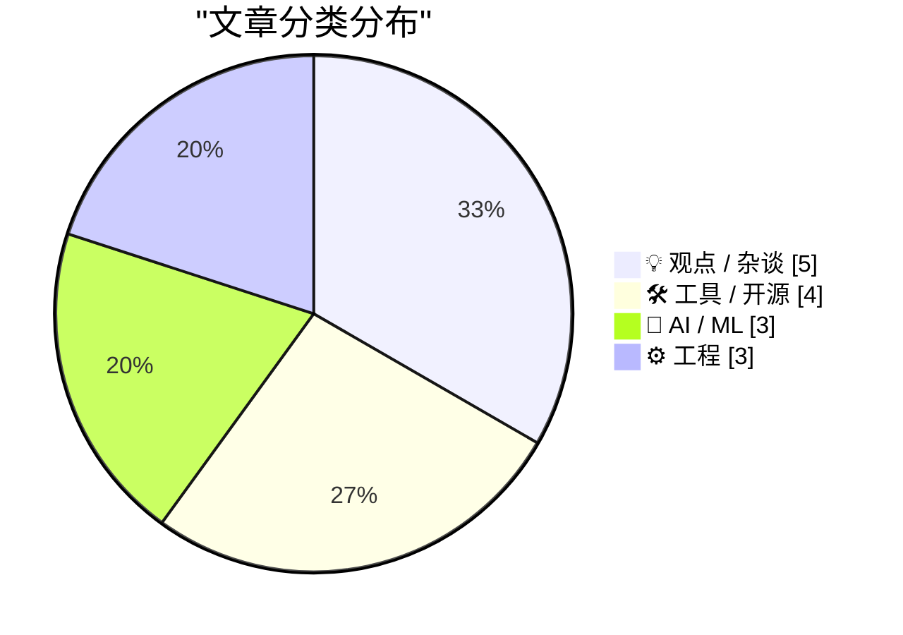
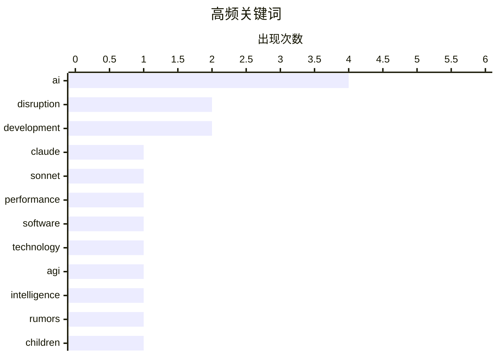

# 📰 AI 博客每日精选 — 2026-02-19

> 来自 Karpathy 推荐的 92 个顶级技术博客，AI 精选 Top 15

## 📝 今日看点

今日技术圈的焦点集中在人工智能的快速发展与其潜在风险上。随着Claude Sonnet 4.6的发布，AI模型的定价策略引发了对市场竞争的讨论。同时，关于通用人工智能（AGI）的夸大宣传和AI对儿童安全的威胁问题也引起了广泛关注，显示出技术进步与社会责任之间的紧张关系。整体来看，AI技术的创新与伦理挑战并存，成为当前讨论的核心。

---

## 🏆 今日必读

🥇 **介绍 Claude Sonnet 4.6**

[Introducing Claude Sonnet 4.6](https://simonwillison.net/2026/Feb/17/claude-sonnet-46/#atom-everything) — simonwillison.net · 1 天前 · 🤖 AI / ML

> Claude Sonnet 4.6 发布，Anthropic 宣称其性能与 4.5 版本的 Opus 相似，但保持了每百万输入 $3 和每百万输出 $15 的定价，而 Opus 模型的定价为 $5/$25。新版本在性能和成本之间提供了更具竞争力的选择，适合需要高效处理的用户。作者认为，Sonnet 4.6 是对市场需求的有效回应，可能会吸引更多用户的关注。

💡 **为什么值得读**: 值得阅读，因为它揭示了新版本 Claude Sonnet 4.6 在性能和定价上的优势，适合对 AI 模型感兴趣的读者。

🏷️ Claude, Sonnet, performance

🥈 **The A.I. Disruption We’ve Been Waiting for Has Arrived**

[The A.I. Disruption We’ve Been Waiting for Has Arrived](https://simonwillison.net/2026/Feb/18/the-ai-disruption/#atom-everything) — simonwillison.net · 17 小时前 · 💡 观点 / 杂谈

> <p><strong><a href="https://www.nytimes.com/2026/02/18/opinion/ai-software.html?unlocked_article_code=1.NFA.UkLv.r-XczfzYRdXJ&amp;smid=url-share">The A.I. Disruption We’ve Been Waiting for Has Arrived

🏷️ AI, disruption, software

🥉 **Paul Ford: ‘The A.I. Disruption Has Arrived, and It Sure Is Fun’**

[Paul Ford: ‘The A.I. Disruption Has Arrived, and It Sure Is Fun’](https://www.nytimes.com/2026/02/18/opinion/ai-software.html?unlocked_article_code=1.NFA.djaw.TBlAp8kE_N-i) — daringfireball.net · 13 小时前 · 💡 观点 / 杂谈

> Paul Ford, in an op-ed for The New York Times (gift link):


  All of the people I love hate this stuff, and all the people I hate love it. And yet, likely because of the same personality flaws that d

🏷️ AI, disruption, technology

---

## 📊 数据概览

| 扫描源 | 抓取文章 | 时间范围 | 精选 |
|:---:|:---:|:---:|:---:|
| 89/92 | 2503 篇 → 39 篇 | 48h | **15 篇** |

### 分类分布



### 高频关键词



<details>
<summary>📈 纯文本关键词图（终端友好）</summary>

```
ai           │ ████████████████████ 4
disruption   │ ██████████░░░░░░░░░░ 2
development  │ ██████████░░░░░░░░░░ 2
claude       │ █████░░░░░░░░░░░░░░░ 1
sonnet       │ █████░░░░░░░░░░░░░░░ 1
performance  │ █████░░░░░░░░░░░░░░░ 1
software     │ █████░░░░░░░░░░░░░░░ 1
technology   │ █████░░░░░░░░░░░░░░░ 1
agi          │ █████░░░░░░░░░░░░░░░ 1
intelligence │ █████░░░░░░░░░░░░░░░ 1
```

</details>

### 🏷️ 话题标签

**ai**(4) · **disruption**(2) · **development**(2) · claude(1) · sonnet(1) · performance(1) · software(1) · technology(1) · agi(1) · intelligence(1) · rumors(1) · children(1) · ethics(1) · safety(1) · llms(1) · skills(1) · raspberry pi(1) · object detection(1) · frigate(1) · type hints(1)

---

## 💡 观点 / 杂谈

### 1. The A.I. Disruption We’ve Been Waiting for Has Arrived

[The A.I. Disruption We’ve Been Waiting for Has Arrived](https://simonwillison.net/2026/Feb/18/the-ai-disruption/#atom-everything) — **simonwillison.net** · 17 小时前 · ⭐ 26/30

> <p><strong><a href="https://www.nytimes.com/2026/02/18/opinion/ai-software.html?unlocked_article_code=1.NFA.UkLv.r-XczfzYRdXJ&amp;smid=url-share">The A.I. Disruption We’ve Been Waiting for Has Arrived

🏷️ AI, disruption, software

---

### 2. Paul Ford: ‘The A.I. Disruption Has Arrived, and It Sure Is Fun’

[Paul Ford: ‘The A.I. Disruption Has Arrived, and It Sure Is Fun’](https://www.nytimes.com/2026/02/18/opinion/ai-software.html?unlocked_article_code=1.NFA.djaw.TBlAp8kE_N-i) — **daringfireball.net** · 13 小时前 · ⭐ 26/30

> Paul Ford, in an op-ed for The New York Times (gift link):


  All of the people I love hate this stuff, and all the people I hate love it. And yet, likely because of the same personality flaws that d

🏷️ AI, disruption, technology

---

### 3. Quoting Martin Fowler

[Quoting Martin Fowler](https://simonwillison.net/2026/Feb/18/martin-fowler/#atom-everything) — **simonwillison.net** · 17 小时前 · ⭐ 23/30

> <blockquote cite="https://martinfowler.com/fragments/2026-02-18.html"><p>LLMs are eating specialty skills. There will be less use of specialist front-end and back-end developers as the LLM-driving ski

🏷️ LLMs, skills, development

---

### 4. The case for gatekeeping, or: why medieval guilds had it figured out

[The case for gatekeeping, or: why medieval guilds had it figured out](https://www.joanwestenberg.com/the-case-for-gatekeeping-or-why-medieval-guilds-had-it-figured-out/) — **joanwestenberg.com** · 1 天前 · ⭐ 22/30

> Every open source maintainer I&apos;ve talked to in the last six months has the same complaint: the absolute flood of mass-produced, AI-generated, mass-submitted slop requests have turned their reposi

🏷️ gatekeeping, open source, AI

---

### 5. 思考提升思考

[Thinking Improves Thinking](https://idiallo.com/blog/taking-our-mind-for-granted?src=feed) — **idiallo.com** · 22 小时前 · ⭐ 20/30

> 文章探讨了在没有人工智能辅助的情况下，如何通过思考解决问题。作者强调，面对问题时，静下心来思考是找到解决方案的关键，甚至在散步时也能激发思维。通过这种方式，思维能够在不被打扰的状态下逐渐形成解决方案。结论是，重视思考过程对于解决复杂问题至关重要。

🏷️ thinking, ChatGPT, problem solving

---

## 🛠 工具 / 开源

### 6. Frigate with Hailo for object detection on a Raspberry Pi

[Frigate with Hailo for object detection on a Raspberry Pi](https://www.jeffgeerling.com/blog/2026/frigate-with-hailo-for-object-detection-on-a-raspberry-pi/) — **jeffgeerling.com** · 13 小时前 · ⭐ 23/30

> <p>I run <a href="https://frigate.video">Frigate</a> to record security cameras and detect people, cars, and animals when in view. My <a href="https://www.jeffgeerling.com/blog/2024/building-pi-frigat

🏷️ Raspberry Pi, object detection, Frigate

---

### 7. Rodney v0.4.0

[Rodney v0.4.0](https://simonwillison.net/2026/Feb/17/rodney/#atom-everything) — **simonwillison.net** · 1 天前 · ⭐ 20/30

> <p><strong><a href="https://github.com/simonw/rodney/releases/tag/v0.4.0">Rodney v0.4.0</a></strong></p>
My <a href="https://github.com/simonw/rodney">Rodney</a> CLI tool for browser automation attrac

🏷️ Rodney, CLI, automation

---

### 8. Epomaker Split 70 机械键盘评测

[Gadget Review: Epomaker Split 70 Mechanical Keyboard ★★★★⯪](https://shkspr.mobi/blog/2026/02/gadget-review-epomaker-split-70-mechanical-keyboard/) — **shkspr.mobi** · 1 天前 · ⭐ 20/30

> 评测介绍了Epomaker的新款“Split 70”机械键盘，这款键盘采用分体设计，通过USB-C连接，用户可以根据需要自由调整位置。评测中提到，该键盘在舒适性和灵活性方面表现出色，适合长时间使用。结论是，这款键盘是追求人体工学设计用户的理想选择。

🏷️ mechanical keyboard, ergonomic, review

---

### 9. SWE-bench 2026年2月排行榜更新

[SWE-bench February 2026 leaderboard update](https://simonwillison.net/2026/Feb/19/swe-bench/#atom-everything) — **simonwillison.net** · 5 小时前 · ⭐ 18/30

> 文章更新了SWE-bench的排行榜，强调此次更新的重要性，因为它提供了与当前模型的基准测试结果，而非实验室自报的数据。新结果针对“仅限Bash”的基准测试，展示了最新模型的性能。结论是，独立的基准测试结果为模型评估提供了更可靠的依据。

🏷️ benchmark, leaderboard, SWE-bench

---

## 🤖 AI / ML

### 10. 介绍 Claude Sonnet 4.6

[Introducing Claude Sonnet 4.6](https://simonwillison.net/2026/Feb/17/claude-sonnet-46/#atom-everything) — **simonwillison.net** · 1 天前 · ⭐ 27/30

> Claude Sonnet 4.6 发布，Anthropic 宣称其性能与 4.5 版本的 Opus 相似，但保持了每百万输入 $3 和每百万输出 $15 的定价，而 Opus 模型的定价为 $5/$25。新版本在性能和成本之间提供了更具竞争力的选择，适合需要高效处理的用户。作者认为，Sonnet 4.6 是对市场需求的有效回应，可能会吸引更多用户的关注。

🏷️ Claude, Sonnet, performance

---

### 11. Rumors of AGI’s arrival have been greatly exaggerated

[Rumors of AGI’s arrival have been greatly exaggerated](https://garymarcus.substack.com/p/rumors-of-agis-arrival-have-been) — **garymarcus.substack.com** · 1 天前 · ⭐ 25/30

> Statistical approximation ≠ general intelligence

🏷️ AGI, intelligence, rumors

---

### 12. How did we end up threatening our kids’ lives with AI?

[How did we end up threatening our kids’ lives with AI?](https://anildash.com/2026/02/18/threatening-kids-with-AI/) — **anildash.com** · 1 天前 · ⭐ 24/30

> I have to begin by warning you about the content in this piece; while I won’t be dwelling on any specifics, this will necessarily be a broad discussion about some of the most disturbing topics imagina

🏷️ AI, children, ethics, safety

---

## ⚙️ 工程

### 13. Typing without having to type

[Typing without having to type](https://simonwillison.net/2026/Feb/18/typing/#atom-everything) — **simonwillison.net** · 15 小时前 · ⭐ 22/30

> <p>25+ years into my career as a programmer I think I may <em>finally</em> be coming around to preferring type hints or even strong typing. I resisted those in the past because they slowed down the ra

🏷️ type hints, programming, iteration

---

### 14. 包管理系统可以从OCI借鉴的内容

[What Package Registries Could Borrow from OCI](https://nesbitt.io/2026/02/18/what-package-registries-could-borrow-from-oci.html) — **nesbitt.io** · 1 天前 · ⭐ 19/30

> 文章讨论了OCI的存储原语在包管理中的应用潜力。作者分析了OCI的设计理念如何能够提升包管理系统的效率和安全性，并提出了一些具体的改进建议。结论是，借鉴OCI的原则可以为包管理带来显著的优化。

🏷️ package registries, OCI, management

---

### 15. 意识流驱动开发

[Stream of Consciousness Driven Development](https://buttondown.com/hillelwayne/archive/stream-of-consciousness-driven-development/) — **buttondown.com/hillelwayne** · 18 小时前 · ⭐ 19/30

> 文章分享了一种新的开发方法，即意识流驱动开发，作者在与客户合作编写规范时，采用这种方法来解决问题。通过创建Markdown文件，作者记录下问题及其详细描述，展示了这种方法的潜力。结论是，意识流写作可以有效提升问题解决的效率。

🏷️ development, spec, stream of consciousness

---

*生成于 2026-02-19 10:40 | 扫描 89 源 → 获取 2503 篇 → 精选 15 篇*
*基于 [Hacker News Popularity Contest 2025](https://refactoringenglish.com/tools/hn-popularity/) RSS 源列表，由 [Andrej Karpathy](https://x.com/karpathy) 推荐*
*由「懂点儿AI」制作，欢迎关注同名微信公众号获取更多 AI 实用技巧 💡*
