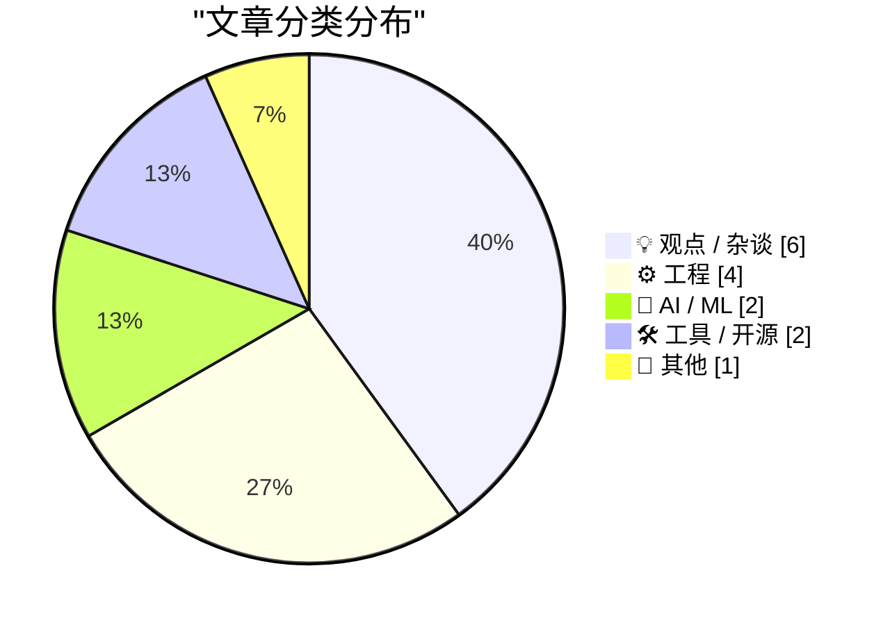
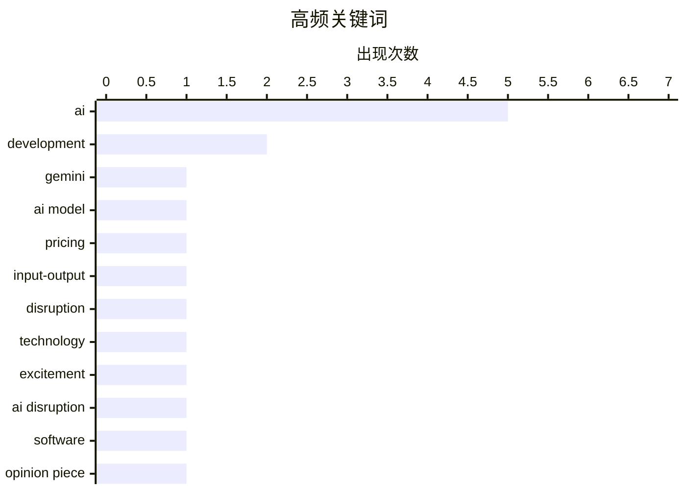

# 📰 AI 博客每日精选 — 2026-02-20

> 来自 Karpathy 推荐的 92 个顶级技术博客，AI 精选 Top 15

## 📝 今日看点

今日技术圈的主要看点集中在人工智能的快速发展和其带来的行业变革上。Gemini 3.1 Pro的发布标志着AI技术在商业应用中的进一步成熟，同时，AI对计算芯片的需求激增也引发了行业的广泛关注。此外，Markdown的流行趋势显示出企业在内容创作和协作工具上的新选择，反映出技术与用户需求之间的紧密联系。整体来看，AI的影响力正在不断扩展，推动着各个领域的创新与变革。

---

## 🏆 今日必读

🥇 **Gemini 3.1 Pro**

[Gemini 3.1 Pro](https://simonwillison.net/2026/Feb/19/gemini-31-pro/#atom-everything) — simonwillison.net · 6 小时前 · 🤖 AI / ML

> Gemini 3.1 Pro是Gemini 3.1系列的首款产品，定价与Gemini 3 Pro相同，输入费用为每百万$2，输出费用为每百万$12，适用于20万以下的token，20万到100万的费用分别为$4和$18。这一价格不到Claude Opus 4.6的一半，且在基准测试中表现相似。相较于Gemini 3 Pro，Gemini 3.1 Pro在SVG动画性能上有所提升。整体来看，Gemini 3.1 Pro在性价比和性能上均具有竞争优势。

💡 **为什么值得读**: 这款产品在价格和性能上都表现出色，值得关注AI模型的用户和开发者。

🏷️ Gemini, AI model, pricing, input-output

🥈 **Paul Ford: ‘The A.I. Disruption Has Arrived, and It Sure Is Fun’**

[Paul Ford: ‘The A.I. Disruption Has Arrived, and It Sure Is Fun’](https://www.nytimes.com/2026/02/18/opinion/ai-software.html?unlocked_article_code=1.NFA.djaw.TBlAp8kE_N-i) — daringfireball.net · 1 天前 · 💡 观点 / 杂谈

> Paul Ford, in an op-ed for The New York Times (gift link):


  All of the people I love hate this stuff, and all the people I hate love it. And yet, likely because of the same personality flaws that d

🏷️ AI, disruption, technology, excitement

🥉 **The A.I. Disruption We’ve Been Waiting for Has Arrived**

[The A.I. Disruption We’ve Been Waiting for Has Arrived](https://simonwillison.net/2026/Feb/18/the-ai-disruption/#atom-everything) — simonwillison.net · 1 天前 · 💡 观点 / 杂谈

> <p><strong><a href="https://www.nytimes.com/2026/02/18/opinion/ai-software.html?unlocked_article_code=1.NFA.UkLv.r-XczfzYRdXJ&amp;smid=url-share">The A.I. Disruption We’ve Been Waiting for Has Arrived

🏷️ AI disruption, software, opinion piece

---

## 📊 数据概览

| 扫描源 | 抓取文章 | 时间范围 | 精选 |
|:---:|:---:|:---:|:---:|
| 89/92 | 2503 篇 → 29 篇 | 48h | **15 篇** |

### 分类分布



### 高频关键词



<details>
<summary>📈 纯文本关键词图（终端友好）</summary>

```
ai            │ ████████████████████ 5
development   │ ████████░░░░░░░░░░░░ 2
gemini        │ ████░░░░░░░░░░░░░░░░ 1
ai model      │ ████░░░░░░░░░░░░░░░░ 1
pricing       │ ████░░░░░░░░░░░░░░░░ 1
input-output  │ ████░░░░░░░░░░░░░░░░ 1
disruption    │ ████░░░░░░░░░░░░░░░░ 1
technology    │ ████░░░░░░░░░░░░░░░░ 1
excitement    │ ████░░░░░░░░░░░░░░░░ 1
ai disruption │ ████░░░░░░░░░░░░░░░░ 1
```

</details>

### 🏷️ 话题标签

**ai**(5) · **development**(2) · **gemini**(1) · ai model(1) · pricing(1) · input-output(1) · disruption(1) · technology(1) · excitement(1) · ai disruption(1) · software(1) · opinion piece(1) · chips(1) · demand(1) · industry(1) · frigate(1) · raspberry pi(1) · object detection(1) · gatekeeping(1) · open source(1)

---

## 💡 观点 / 杂谈

### 1. Paul Ford: ‘The A.I. Disruption Has Arrived, and It Sure Is Fun’

[Paul Ford: ‘The A.I. Disruption Has Arrived, and It Sure Is Fun’](https://www.nytimes.com/2026/02/18/opinion/ai-software.html?unlocked_article_code=1.NFA.djaw.TBlAp8kE_N-i) — **daringfireball.net** · 1 天前 · ⭐ 25/30

> Paul Ford, in an op-ed for The New York Times (gift link):


  All of the people I love hate this stuff, and all the people I hate love it. And yet, likely because of the same personality flaws that d

🏷️ AI, disruption, technology, excitement

---

### 2. The A.I. Disruption We’ve Been Waiting for Has Arrived

[The A.I. Disruption We’ve Been Waiting for Has Arrived](https://simonwillison.net/2026/Feb/18/the-ai-disruption/#atom-everything) — **simonwillison.net** · 1 天前 · ⭐ 24/30

> <p><strong><a href="https://www.nytimes.com/2026/02/18/opinion/ai-software.html?unlocked_article_code=1.NFA.UkLv.r-XczfzYRdXJ&amp;smid=url-share">The A.I. Disruption We’ve Been Waiting for Has Arrived

🏷️ AI disruption, software, opinion piece

---

### 3. The case for gatekeeping, or: why medieval guilds had it figured out

[The case for gatekeeping, or: why medieval guilds had it figured out](https://www.joanwestenberg.com/the-case-for-gatekeeping-or-why-medieval-guilds-had-it-figured-out/) — **joanwestenberg.com** · 1 天前 · ⭐ 22/30

> Every open source maintainer I&apos;ve talked to in the last six months has the same complaint: the absolute flood of mass-produced, AI-generated, mass-submitted slop requests have turned their reposi

🏷️ gatekeeping, open source, AI, contributions

---

### 4. Quoting Martin Fowler

[Quoting Martin Fowler](https://simonwillison.net/2026/Feb/18/martin-fowler/#atom-everything) — **simonwillison.net** · 1 天前 · ⭐ 19/30

> <blockquote cite="https://martinfowler.com/fragments/2026-02-18.html"><p>LLMs are eating specialty skills. There will be less use of specialist front-end and back-end developers as the LLM-driving ski

🏷️ LLMs, skills, development

---

### 5. Thinking Improves Thinking

[Thinking Improves Thinking](https://idiallo.com/blog/taking-our-mind-for-granted?src=feed) — **idiallo.com** · 1 天前 · ⭐ 18/30

> How did we do it before ChatGPT? How did we write full sentences, connect ideas into a coherent arc, solve problems that had no obvious answer? We thought. That's it. We simply sat with discomfort lon

🏷️ thinking, ChatGPT, problem-solving, creativity

---

### 6. 关于关怀的一些随想

[A Few Rambling Observations on Care](https://blog.jim-nielsen.com/2026/observations-on-care/) — **blog.jim-nielsen.com** · 1 天前 · ⭐ 17/30

> 文章讨论了在AI时代，'关怀'作为一种产品特质的重要性。作者质疑是否可以量化关怀，并探讨了规模化是否会削弱关怀的体现。通过反思，作者认为在数字化和量化的背景下，关怀可能会被忽视，呼吁关注产品中的人性化设计。

🏷️ AI, care, taste

---

## ⚙️ 工程

### 7. AI is a NAND Maximiser

[AI is a NAND Maximiser](https://shkspr.mobi/blog/2026/02/ai-is-a-nand-maximiser/) — **shkspr.mobi** · 11 小时前 · ⭐ 24/30

> PC Gamer is reporting that the current demand by AI companies for computer chips is having a disastrous effect on the rest of the industry.  In an interview, the CEO of Phison said:  If NVIDIA Vera Ru

🏷️ AI, chips, demand, industry

---

### 8. Typing without having to type

[Typing without having to type](https://simonwillison.net/2026/Feb/18/typing/#atom-everything) — **simonwillison.net** · 1 天前 · ⭐ 20/30

> <p>25+ years into my career as a programmer I think I may <em>finally</em> be coming around to preferring type hints or even strong typing. I resisted those in the past because they slowed down the ra

🏷️ type hints, programming, iteration

---

### 9. 意识流驱动开发

[Stream of Consciousness Driven Development](https://buttondown.com/hillelwayne/archive/stream-of-consciousness-driven-development/) — **buttondown.com/hillelwayne** · 1 天前 · ⭐ 17/30

> 文章介绍了一种新的开发方法——意识流驱动开发，作者在与客户合作编写规范时首次尝试。通过创建Markdown文件，作者详细记录了问题及其解决方案，展示了这种方法在解决复杂问题时的有效性。作者认为，这种方法能够提高沟通效率和问题解决能力。

🏷️ development, spec, collaboration

---

### 10. LadybirdBrowser/ladybird: 放弃Swift采用

[LadybirdBrowser/ladybird: Abandon Swift adoption](https://simonwillison.net/2026/Feb/19/ladybird/#atom-everything) — **simonwillison.net** · 22 小时前 · ⭐ 16/30

> Ladybird浏览器项目宣布放弃采用Swift作为内存安全语言的计划，回顾了2024年曾有的采用意图。文章分析了这一决定的背景和原因，指出在技术选择上需要权衡多方面因素。作者强调，选择合适的语言对项目的长期发展至关重要。

🏷️ Swift, browser, adoption

---

## 🤖 AI / ML

### 11. Gemini 3.1 Pro

[Gemini 3.1 Pro](https://simonwillison.net/2026/Feb/19/gemini-31-pro/#atom-everything) — **simonwillison.net** · 6 小时前 · ⭐ 26/30

> Gemini 3.1 Pro是Gemini 3.1系列的首款产品，定价与Gemini 3 Pro相同，输入费用为每百万$2，输出费用为每百万$12，适用于20万以下的token，20万到100万的费用分别为$4和$18。这一价格不到Claude Opus 4.6的一半，且在基准测试中表现相似。相较于Gemini 3 Pro，Gemini 3.1 Pro在SVG动画性能上有所提升。整体来看，Gemini 3.1 Pro在性价比和性能上均具有竞争优势。

🏷️ Gemini, AI model, pricing, input-output

---

### 12. SWE-bench 2026年2月排行榜更新

[SWE-bench February 2026 leaderboard update](https://simonwillison.net/2026/Feb/19/swe-bench/#atom-everything) — **simonwillison.net** · 19 小时前 · ⭐ 17/30

> SWE-bench是一个广受欢迎的基准测试，最近更新了排行榜，展示了当前模型的性能。此次更新的结果并非实验室自报，而是经过全面测试，提供了更可靠的对比数据。文章强调了基准测试在评估模型性能中的重要性，尤其是在快速发展的AI领域。

🏷️ benchmark, leaderboard, model

---

## 🛠 工具 / 开源

### 13. Frigate with Hailo for object detection on a Raspberry Pi

[Frigate with Hailo for object detection on a Raspberry Pi](https://www.jeffgeerling.com/blog/2026/frigate-with-hailo-for-object-detection-on-a-raspberry-pi/) — **jeffgeerling.com** · 1 天前 · ⭐ 23/30

> <p>I run <a href="https://frigate.video">Frigate</a> to record security cameras and detect people, cars, and animals when in view. My <a href="https://www.jeffgeerling.com/blog/2024/building-pi-frigat

🏷️ Frigate, Raspberry Pi, object detection

---

### 14. Go模块用于包管理工具

[Go Modules for Package Management Tooling](https://nesbitt.io/2026/02/19/go-modules-for-package-management-tooling.html) — **nesbitt.io** · 1 天前 · ⭐ 18/30

> 文章探讨了Go模块在包管理工具中的应用。作者从Ruby供应链库重建了git-pkgs，展示了Go模块如何简化依赖管理和版本控制。通过具体示例，文章强调了Go模块在提高开发效率和减少复杂性方面的优势。作者认为，Go模块是现代Go开发中不可或缺的工具。

🏷️ Go, modules, package management, tooling

---

## 📝 其他

### 15. Markdown’s Moment

[Markdown’s Moment](https://feed.tedium.co/link/15204/17278321/markdown-growing-influence-cloudflare-ai) — **tedium.co** · 1 天前 · ⭐ 21/30

> For some reason, a bunch of big companies are really leaning into Markdown right now. AI may be the reason, but I kind of love the possible side benefits.

🏷️ Markdown, AI, companies

---

*生成于 2026-02-20 00:02 | 扫描 89 源 → 获取 2503 篇 → 精选 15 篇*
*基于 [Hacker News Popularity Contest 2025](https://refactoringenglish.com/tools/hn-popularity/) RSS 源列表，由 [Andrej Karpathy](https://x.com/karpathy) 推荐*
*由「懂点儿AI」制作，欢迎关注同名微信公众号获取更多 AI 实用技巧 💡*
