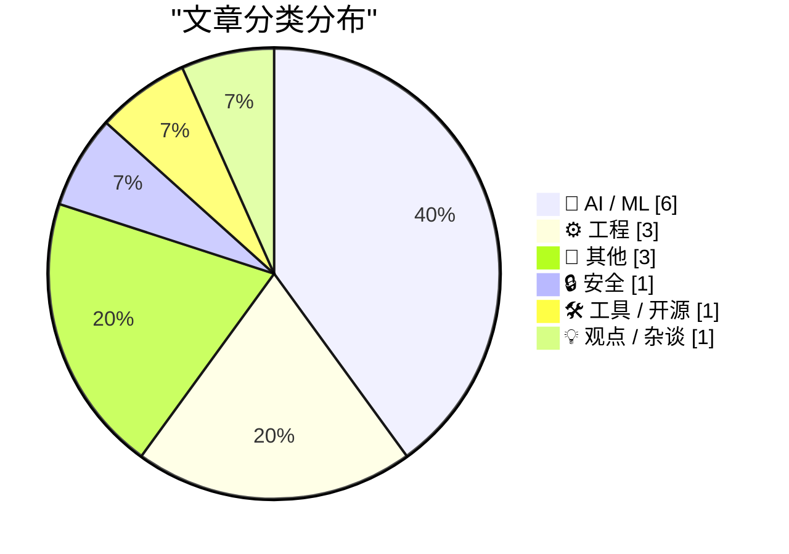
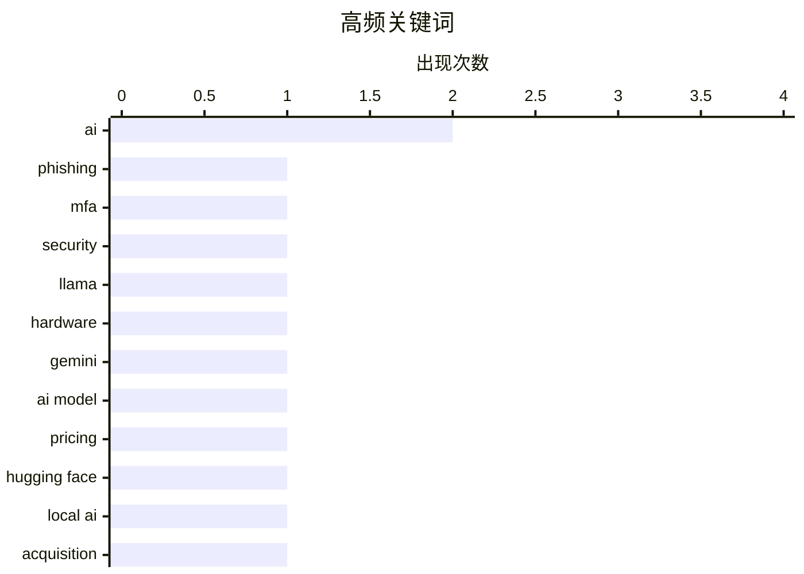

# 📰 AI 博客每日精选 — 2026-02-21

> 来自 Karpathy 推荐的 92 个顶级技术博客，AI 精选 Top 15

## 📝 今日看点

今日技术圈的焦点集中在网络安全和人工智能两个领域。在网络安全方面，新的钓鱼服务“Starkiller”通过伪装真实登录页面，展示了网络攻击手段的不断演变，反映出安全防护的紧迫性。同时，人工智能领域持续快速发展，新的模型如Llama 3.1和Gemini 3.1 Pro的推出，显示出对计算资源的高需求，推动了芯片市场的变化。这些趋势表明，技术创新与安全挑战之间的博弈愈发激烈。

---

## 🏆 今日必读

🥇 **‘Starkiller’ 钓鱼服务代理真实登录页面和多因素认证**

[‘Starkiller’ Phishing Service Proxies Real Login Pages, MFA](https://krebsonsecurity.com/2026/02/starkiller-phishing-service-proxies-real-login-pages-mfa/) — krebsonsecurity.com · 4 小时前 · 🔒 安全

> 新出现的钓鱼即服务（Phishing-as-a-Service）‘Starkiller’允许用户通过伪装链接加载目标品牌的真实网站，从而避开反钓鱼活动的监测。该服务充当中介，将受害者的用户名、密码和多因素认证信息转发给合法网站，极大地提高了钓鱼攻击的成功率。此技术的隐蔽性和高效性使得传统的反钓鱼措施面临挑战，安全专家对此表示担忧。

💡 **为什么值得读**: 这篇文章深入探讨了新型钓鱼服务的运作机制及其对网络安全的潜在威胁，值得关注。

🏷️ phishing, MFA, security

🥈 **Taalas serves Llama 3.1 8B at 17,000 tokens/second**

[Taalas serves Llama 3.1 8B at 17,000 tokens/second](https://simonwillison.net/2026/Feb/20/taalas/#atom-everything) — simonwillison.net · 1 小时前 · 🤖 AI / ML

> <p><strong><a href="https://taalas.com/the-path-to-ubiquitous-ai/">Taalas serves Llama 3.1 8B at 17,000 tokens/second</a></strong></p>
This new Canadian hardware startup just announced their first pro

🏷️ Llama, hardware, AI

🥉 **Gemini 3.1 Pro**

[Gemini 3.1 Pro](https://simonwillison.net/2026/Feb/19/gemini-31-pro/#atom-everything) — simonwillison.net · 1 天前 · 🤖 AI / ML

> <p><strong><a href="https://blog.google/innovation-and-ai/models-and-research/gemini-models/gemini-3-1-pro/">Gemini 3.1 Pro</a></strong></p>
The first in the Gemini 3.1 series, priced the same as Gemi

🏷️ Gemini, AI model, pricing

---

## 📊 数据概览

| 扫描源 | 抓取文章 | 时间范围 | 精选 |
|:---:|:---:|:---:|:---:|
| 88/92 | 2479 篇 → 29 篇 | 48h | **15 篇** |

### 分类分布



### 高频关键词



<details>
<summary>📈 纯文本关键词图（终端友好）</summary>

```
ai           │ ████████████████████ 2
phishing     │ ██████████░░░░░░░░░░ 1
mfa          │ ██████████░░░░░░░░░░ 1
security     │ ██████████░░░░░░░░░░ 1
llama        │ ██████████░░░░░░░░░░ 1
hardware     │ ██████████░░░░░░░░░░ 1
gemini       │ ██████████░░░░░░░░░░ 1
ai model     │ ██████████░░░░░░░░░░ 1
pricing      │ ██████████░░░░░░░░░░ 1
hugging face │ ██████████░░░░░░░░░░ 1
```

</details>

### 🏷️ 话题标签

**ai**(2) · **phishing**(1) · **mfa**(1) · security(1) · llama(1) · hardware(1) · gemini(1) · ai model(1) · pricing(1) · hugging face(1) · local ai(1) · acquisition(1) · chips(1) · nvidia(1) · industry impact(1) · aws(1) · efficiency(1) · production(1) · benchmark(1) · leaderboard(1)

---

## 🤖 AI / ML

### 1. Taalas serves Llama 3.1 8B at 17,000 tokens/second

[Taalas serves Llama 3.1 8B at 17,000 tokens/second](https://simonwillison.net/2026/Feb/20/taalas/#atom-everything) — **simonwillison.net** · 1 小时前 · ⭐ 27/30

> <p><strong><a href="https://taalas.com/the-path-to-ubiquitous-ai/">Taalas serves Llama 3.1 8B at 17,000 tokens/second</a></strong></p>
This new Canadian hardware startup just announced their first pro

🏷️ Llama, hardware, AI

---

### 2. Gemini 3.1 Pro

[Gemini 3.1 Pro](https://simonwillison.net/2026/Feb/19/gemini-31-pro/#atom-everything) — **simonwillison.net** · 1 天前 · ⭐ 27/30

> <p><strong><a href="https://blog.google/innovation-and-ai/models-and-research/gemini-models/gemini-3-1-pro/">Gemini 3.1 Pro</a></strong></p>
The first in the Gemini 3.1 series, priced the same as Gemi

🏷️ Gemini, AI model, pricing

---

### 3. ggml.ai joins Hugging Face to ensure the long-term progress of Local AI

[ggml.ai joins Hugging Face to ensure the long-term progress of Local AI](https://simonwillison.net/2026/Feb/20/ggmlai-joins-hugging-face/#atom-everything) — **simonwillison.net** · 6 小时前 · ⭐ 24/30

> <p><strong><a href="https://github.com/ggml-org/llama.cpp/discussions/19759">ggml.ai joins Hugging Face to ensure the long-term progress of Local AI</a></strong></p>
I don't normally cover acquisition

🏷️ Hugging Face, Local AI, acquisition

---

### 4. AI is a NAND Maximiser

[AI is a NAND Maximiser](https://shkspr.mobi/blog/2026/02/ai-is-a-nand-maximiser/) — **shkspr.mobi** · 1 天前 · ⭐ 24/30

> PC Gamer is reporting that the current demand by AI companies for computer chips is having a disastrous effect on the rest of the industry.  In an interview, the CEO of Phison said:  If NVIDIA Vera Ru

🏷️ AI, chips, NVIDIA, industry impact

---

### 5. SWE-bench February 2026 leaderboard update

[SWE-bench February 2026 leaderboard update](https://simonwillison.net/2026/Feb/19/swe-bench/#atom-everything) — **simonwillison.net** · 1 天前 · ⭐ 21/30

> <p><strong><a href="https://www.swebench.com/">SWE-bench February 2026 leaderboard update</a></strong></p>
SWE-bench is one of the benchmarks that the labs love to list in their model releases. The of

🏷️ benchmark, leaderboard, model

---

### 6. Premium: The Hater's Guide to Anthropic

[Premium: The Hater's Guide to Anthropic](https://www.wheresyoured.at/premium-the-haters-guide-to-anthropic/) — **wheresyoured.at** · 5 小时前 · ⭐ 19/30

> In May 2021, Dario Amodei and a crew of other former OpenAI researchers formed Anthropic and dedicated themselves to building the single-most-annoying Large Language Model company of all time.&#xA0;Pa

🏷️ Anthropic, LLM, safety

---

## ⚙️ 工程

### 7. Is the Future “AWS for Everything”?

[Is the Future “AWS for Everything”?](https://www.construction-physics.com/p/is-the-future-aws-for-everything) — **construction-physics.com** · 1 天前 · ⭐ 22/30

> A theme running through my book is the idea that efficiency improvements, and the various methods for making products cheaper over time, have historically been dependent on some degree of repetition, 

🏷️ AWS, efficiency, production

---

### 8. 恢复丢失的代码

[Recovering lost code](https://simonwillison.net/2026/Feb/19/recovering-lost-code/#atom-everything) — **simonwillison.net** · 1 天前 · ⭐ 16/30

> 在一次计算机崩溃后，作者发现自己丢失了一个功能的代码，但最终通过 Claude Code 的会话日志找回了丢失的代码。该工具能够提取出丢失的功能并重新启动，展示了其在代码恢复方面的强大能力。作者的经历强调了备份和会话管理的重要性。

🏷️ code, feature, recovery

---

### 9. LadybirdBrowser/ladybird: 放弃 Swift 采用

[LadybirdBrowser/ladybird: Abandon Swift adoption](https://simonwillison.net/2026/Feb/19/ladybird/#atom-everything) — **simonwillison.net** · 1 天前 · ⭐ 15/30

> Ladybird 浏览器项目最初计划采用 Swift 作为其内存安全语言，但最近决定放弃这一计划。该决定反映了项目在技术选择上的变化，可能会影响其未来的开发方向。作者指出，选择合适的编程语言对项目的成功至关重要。

🏷️ browser, Swift, adoption

---

## 📝 其他

### 10. ActivityPub

[ActivityPub](https://nesbitt.io/2026/02/20/activitypub.html) — **nesbitt.io** · 1 天前 · ⭐ 19/30

> The federated protocol for announcing pub activities, first standardised in 1714 and still in use across 46,000 active instances.

🏷️ ActivityPub, federated protocol, instances

---

### 11. 在我的博客中添加 TIL、发布、博物馆、工具和研究

[Adding TILs, releases, museums, tools and research to my blog](https://simonwillison.net/2026/Feb/20/beats/#atom-everything) — **simonwillison.net** · 15 分钟前 · ⭐ 15/30

> 作者在博客中新增了一项名为“beats”的功能，旨在展示其在其他在线活动中的各种内容。该功能包括五种新类型的内容，旨在丰富博客的多样性和互动性。通过这种方式，作者希望更好地与读者分享其活动和创作。

🏷️ blog, content, features

---

### 12. 苹果 3 月 4 日媒体活动的另一个创意：在 Vision Pro 上沉浸式 F1 体验？

[One More Spitball Idea for Apple’s March 4 Media Event ‘Experience’: Immersive F1 on Vision Pro?](https://www.formula1.com/en/latest/article/official-grand-prix-start-times-for-2026-f1-season-confirmed.2UgPfArqH76tzlOYh21jSG) — **daringfireball.net** · 1 天前 · ⭐ 15/30

> 随着 2026 年 F1 赛季的临近，苹果可能会在即将到来的媒体活动中展示其在 VisionOS 上的沉浸式体育直播技术。结合苹果与 F1 的独家合作，这一展示将为用户提供全新的观看体验。作者认为，这将是苹果在沉浸式直播领域的重要一步。

🏷️ Apple, F1, Vision Pro, broadcasting

---

## 🔒 安全

### 13. ‘Starkiller’ 钓鱼服务代理真实登录页面和多因素认证

[‘Starkiller’ Phishing Service Proxies Real Login Pages, MFA](https://krebsonsecurity.com/2026/02/starkiller-phishing-service-proxies-real-login-pages-mfa/) — **krebsonsecurity.com** · 4 小时前 · ⭐ 29/30

> 新出现的钓鱼即服务（Phishing-as-a-Service）‘Starkiller’允许用户通过伪装链接加载目标品牌的真实网站，从而避开反钓鱼活动的监测。该服务充当中介，将受害者的用户名、密码和多因素认证信息转发给合法网站，极大地提高了钓鱼攻击的成功率。此技术的隐蔽性和高效性使得传统的反钓鱼措施面临挑战，安全专家对此表示担忧。

🏷️ phishing, MFA, security

---

## 🛠 工具 / 开源

### 14. CloudPebble Returns! Plus New Pure JavaScript and Round 2 SDK

[CloudPebble Returns! Plus New Pure JavaScript and Round 2 SDK](https://repebble.com/blog/cloudpebble-returns-plus-pure-javascript-and-round-2-sdk) — **ericmigi.com** · 1 天前 · ⭐ 21/30

> As mentioned in our software roadmap, we’ve been working on many improvements to Pebble’s already pretty awesome SDK and developer…

🏷️ CloudPebble, JavaScript, SDK, development

---

## 💡 观点 / 杂谈

### 15. Claude Code 的提示缓存技术

[Quoting Thariq Shihipar](https://simonwillison.net/2026/Feb/20/thariq-shihipar/#atom-everything) — **simonwillison.net** · 16 小时前 · ⭐ 18/30

> 长时间运行的智能产品如 Claude Code 通过提示缓存技术实现了计算的重用，从而显著降低了延迟和成本。高命中率的提示缓存不仅减少了费用，还帮助该平台为订阅计划提供更慷慨的使用限制。作者强调，提示缓存是其产品架构的核心，能够提高用户体验和降低运营成本。

🏷️ Claude Code, prompt caching, latency

---

*生成于 2026-02-21 00:03 | 扫描 88 源 → 获取 2479 篇 → 精选 15 篇*
*基于 [Hacker News Popularity Contest 2025](https://refactoringenglish.com/tools/hn-popularity/) RSS 源列表，由 [Andrej Karpathy](https://x.com/karpathy) 推荐*
*由「懂点儿AI」制作，欢迎关注同名微信公众号获取更多 AI 实用技巧 💡*
