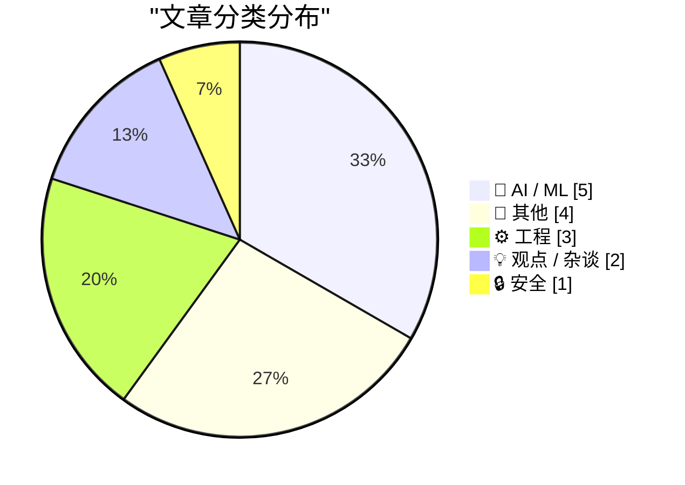
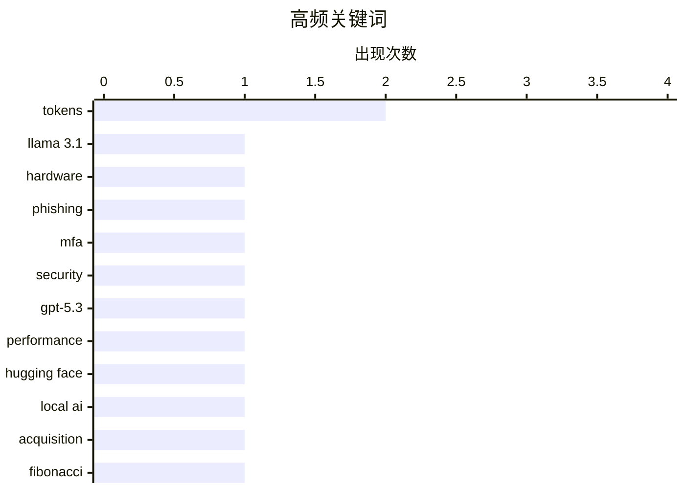

# 📰 AI 博客每日精选 — 2026-02-22

> 来自 Karpathy 推荐的 92 个顶级技术博客，AI 精选 Top 15

## 📝 今日看点

今日技术圈的主要趋势集中在人工智能和安全领域。Taalas公司推出的高性能Llama 3.1 8B模型，展示了定制硬件在大规模语言模型处理中的潜力，预示着AI技术的进一步发展。同时，网络安全方面的“Starkiller”钓鱼服务通过模拟真实登录页面，提醒人们在数字环境中加强防范意识。这些动态反映出技术创新与安全挑战并存的局面。

---

## 🏆 今日必读

🥇 **Taalas以每秒17,000个token的速度提供Llama 3.1 8B服务**

[Taalas serves Llama 3.1 8B at 17,000 tokens/second](https://simonwillison.net/2026/Feb/20/taalas/#atom-everything) — simonwillison.net · 1 天前 · 🤖 AI / ML

> Taalas公司推出了其首款产品——定制硬件实现的Llama 3.1 8B模型，能够以每秒17,000个token的速度运行。该硬件的高性能使其在处理大规模语言模型时具备显著优势。此技术的推出标志着本地AI硬件发展的重要一步，可能会改变AI模型的部署方式。作者认为，这一创新将推动AI技术在各个领域的普及与应用。

💡 **为什么值得读**: 这篇文章揭示了Taalas在AI硬件领域的突破性进展，值得关注未来AI技术的发展方向。

🏷️ Llama 3.1, tokens, hardware

🥈 **‘Starkiller’ Phishing Service Proxies Real Login Pages, MFA**

[‘Starkiller’ Phishing Service Proxies Real Login Pages, MFA](https://krebsonsecurity.com/2026/02/starkiller-phishing-service-proxies-real-login-pages-mfa/) — krebsonsecurity.com · 1 天前 · 🔒 安全

> Most phishing websites are little more than static copies of login pages for popular online destinations, and they are often quickly taken down by anti-abuse activists and security firms. But a stealt

🏷️ phishing, MFA, security

🥉 **Quoting Thibault Sottiaux**

[Quoting Thibault Sottiaux](https://simonwillison.net/2026/Feb/21/thibault-sottiaux/#atom-everything) — simonwillison.net · 22 小时前 · 🤖 AI / ML

> <blockquote cite="https://twitter.com/thsottiaux/status/2024947946849186064"><p>We’ve made GPT-5.3-Codex-Spark about 30% faster. It is now serving at over 1200 tokens per second.</p></blockquote>
<p c

🏷️ GPT-5.3, performance, tokens

---

## 📊 数据概览

| 扫描源 | 抓取文章 | 时间范围 | 精选 |
|:---:|:---:|:---:|:---:|
| 89/92 | 2504 篇 → 23 篇 | 48h | **15 篇** |

### 分类分布



### 高频关键词



<details>
<summary>📈 纯文本关键词图（终端友好）</summary>

```
tokens       │ ████████████████████ 2
llama 3.1    │ ██████████░░░░░░░░░░ 1
hardware     │ ██████████░░░░░░░░░░ 1
phishing     │ ██████████░░░░░░░░░░ 1
mfa          │ ██████████░░░░░░░░░░ 1
security     │ ██████████░░░░░░░░░░ 1
gpt-5.3      │ ██████████░░░░░░░░░░ 1
performance  │ ██████████░░░░░░░░░░ 1
hugging face │ ██████████░░░░░░░░░░ 1
local ai     │ ██████████░░░░░░░░░░ 1
```

</details>

### 🏷️ 话题标签

**tokens**(2) · **llama 3.1**(1) · **hardware**(1) · phishing(1) · mfa(1) · security(1) · gpt-5.3(1) · performance(1) · hugging face(1) · local ai(1) · acquisition(1) · fibonacci(1) · computation(1) · certification(1) · algorithm(1) · anthropic(1) · llm(1) · ai safety(1) · open source(1) · project(1)

---

## 🤖 AI / ML

### 1. Taalas以每秒17,000个token的速度提供Llama 3.1 8B服务

[Taalas serves Llama 3.1 8B at 17,000 tokens/second](https://simonwillison.net/2026/Feb/20/taalas/#atom-everything) — **simonwillison.net** · 1 天前 · ⭐ 27/30

> Taalas公司推出了其首款产品——定制硬件实现的Llama 3.1 8B模型，能够以每秒17,000个token的速度运行。该硬件的高性能使其在处理大规模语言模型时具备显著优势。此技术的推出标志着本地AI硬件发展的重要一步，可能会改变AI模型的部署方式。作者认为，这一创新将推动AI技术在各个领域的普及与应用。

🏷️ Llama 3.1, tokens, hardware

---

### 2. Quoting Thibault Sottiaux

[Quoting Thibault Sottiaux](https://simonwillison.net/2026/Feb/21/thibault-sottiaux/#atom-everything) — **simonwillison.net** · 22 小时前 · ⭐ 24/30

> <blockquote cite="https://twitter.com/thsottiaux/status/2024947946849186064"><p>We’ve made GPT-5.3-Codex-Spark about 30% faster. It is now serving at over 1200 tokens per second.</p></blockquote>
<p c

🏷️ GPT-5.3, performance, tokens

---

### 3. ggml.ai joins Hugging Face to ensure the long-term progress of Local AI

[ggml.ai joins Hugging Face to ensure the long-term progress of Local AI](https://simonwillison.net/2026/Feb/20/ggmlai-joins-hugging-face/#atom-everything) — **simonwillison.net** · 1 天前 · ⭐ 22/30

> <p><strong><a href="https://github.com/ggml-org/llama.cpp/discussions/19759">ggml.ai joins Hugging Face to ensure the long-term progress of Local AI</a></strong></p>
I don't normally cover acquisition

🏷️ Hugging Face, Local AI, acquisition

---

### 4. Premium: The Hater's Guide to Anthropic

[Premium: The Hater's Guide to Anthropic](https://www.wheresyoured.at/premium-the-haters-guide-to-anthropic/) — **wheresyoured.at** · 1 天前 · ⭐ 21/30

> In May 2021, Dario Amodei and a crew of other former OpenAI researchers formed Anthropic and dedicated themselves to building the single-most-annoying Large Language Model company of all time.&#xA0;Pa

🏷️ Anthropic, LLM, AI safety

---

### 5. Quoting Thariq Shihipar

[Quoting Thariq Shihipar](https://simonwillison.net/2026/Feb/20/thariq-shihipar/#atom-everything) — **simonwillison.net** · 1 天前 · ⭐ 18/30

> <blockquote cite="https://twitter.com/trq212/status/2024574133011673516"><p>Long running agentic products like Claude Code are made feasible by prompt caching which allows us to reuse computation from

🏷️ Claude Code, prompt caching, latency

---

## 📝 其他

### 6. Whale Fall

[Whale Fall](https://nesbitt.io/2026/02/21/whale-fall.html) — **nesbitt.io** · 1 天前 · ⭐ 19/30

> What happens when a large open source project dies.

🏷️ open source, project, death, community

---

### 7. OpenBenches at FOSDEM

[OpenBenches at FOSDEM](https://shkspr.mobi/blog/2026/02/openbenches-at-fosdem/) — **shkspr.mobi** · 11 小时前 · ⭐ 17/30

> At the recent FOSDEM, I did a very quick lightning talk about our OpenBenches project.  Sadly, despite the best efforts of the AV team, the video had a missing section. I took my own audio recording a

🏷️ OpenBenches, FOSDEM, video, presentation

---

### 8. Adding TILs, releases, museums, tools and research to my blog

[Adding TILs, releases, museums, tools and research to my blog](https://simonwillison.net/2026/Feb/20/beats/#atom-everything) — **simonwillison.net** · 1 天前 · ⭐ 15/30

> <p>I've been wanting to add indications of my various other online activities to my blog for a while now. I just turned on a new feature I'm calling "beats" (after story beats, naming this was hard!) 

🏷️ blog, features, content

---

### 9. 英伟达只是被邀请投资

[Nvidia was only invited to invest](https://idiallo.com/byte-size/nvidia-was-only-invited-to-invest?src=feed) — **idiallo.com** · 26 分钟前 · ⭐ 12/30

> 英伟达CEO黄仁勋表示，之前关于对OpenAI投资1000亿美元的承诺并不存在。文章提到了一幅图表，展示了AI公司之间的循环投资关系：OpenAI将投资3000亿美元给甲骨文，甲骨文再回投给英伟达。黄仁勋的表态引发了对投资承诺的质疑，显示出投资关系的复杂性和不确定性。

🏷️ Nvidia, investment, OpenAI

---

## ⚙️ 工程

### 10. Computing big, certified Fibonacci numbers

[Computing big, certified Fibonacci numbers](https://www.johndcook.com/blog/2026/02/21/big-certified-fibonacci/) — **johndcook.com** · 5 小时前 · ⭐ 22/30

> I’ve written before about computing big Fibonacci numbers, and about creating a certificate to verify a Fibonacci number has been calculated correctly. This post will revisit both, giving a different 

🏷️ Fibonacci, computation, certification, algorithm

---

### 11. Customizing the ways the dialog manager dismisses itself: Detecting the ESC key, first (failed) attempt

[Customizing the ways the dialog manager dismisses itself: Detecting the ESC key, first (failed) attempt](https://devblogs.microsoft.com/oldnewthing/20260220-00/?p=112074) — **devblogs.microsoft.com/oldnewthing** · 1 天前 · ⭐ 16/30

> Sniffing the asynchronous keyboard state.
The post Customizing the ways the dialog manager dismisses itself: Detecting the ESC key, first (failed) attempt appeared first on The Old New Thing.

🏷️ dialog manager, ESC key, customization, asynchronous

---

### 12. Wrapping Code Comments

[Wrapping Code Comments](https://matklad.github.io/2026/02/21/wrapping-code-comments.html) — **matklad.github.io** · 1 天前 · ⭐ 13/30

> I was today years old when I realized that:

🏷️ code comments, programming, best practices, documentation

---

## 💡 观点 / 杂谈

### 13. Andrej Karpathy talks about "Claws"

[Andrej Karpathy talks about "Claws"](https://simonwillison.net/2026/Feb/21/claws/#atom-everything) — **simonwillison.net** · 23 小时前 · ⭐ 15/30

> <p><strong><a href="https://twitter.com/karpathy/status/2024987174077432126">Andrej Karpathy talks about "Claws"</a></strong></p>
Andrej Karpathy tweeted a mini-essay about buying a Mac Mini ("The app

🏷️ Andrej Karpathy, Mac Mini, tinkering

---

### 14. The unbearable weight of cruft

[The unbearable weight of cruft](https://www.joanwestenberg.com/the-unbearable-weight-of-cruft/) — **joanwestenberg.com** · 1 天前 · ⭐ 13/30

> 

🏷️ cruft, software, development, maintenance

---

## 🔒 安全

### 15. ‘Starkiller’ Phishing Service Proxies Real Login Pages, MFA

[‘Starkiller’ Phishing Service Proxies Real Login Pages, MFA](https://krebsonsecurity.com/2026/02/starkiller-phishing-service-proxies-real-login-pages-mfa/) — **krebsonsecurity.com** · 1 天前 · ⭐ 26/30

> Most phishing websites are little more than static copies of login pages for popular online destinations, and they are often quickly taken down by anti-abuse activists and security firms. But a stealt

🏷️ phishing, MFA, security

---

*生成于 2026-02-22 00:02 | 扫描 89 源 → 获取 2504 篇 → 精选 15 篇*
*基于 [Hacker News Popularity Contest 2025](https://refactoringenglish.com/tools/hn-popularity/) RSS 源列表，由 [Andrej Karpathy](https://x.com/karpathy) 推荐*
*由「懂点儿AI」制作，欢迎关注同名微信公众号获取更多 AI 实用技巧 💡*
